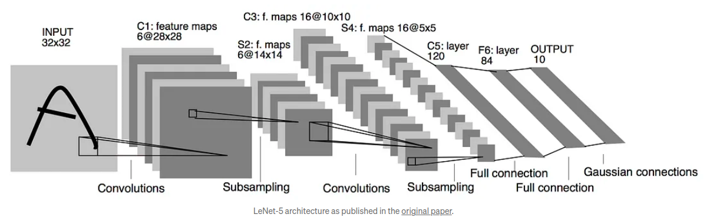

<!-- PROJECT SHIELDS -->
[![Contributors][contributors-shield]][contributors-url]
[![Forks][forks-shield]][forks-url]
[![Stargazers][stars-shield]][stars-url]
[![Issues][issues-shield]][issues-url]
[![LinkedIn][linkedin-shield]][linkedin-url]

<!-- PROJECT LOGO -->
 

<h3 align="center"> LeNet-5 from Scratch</h3>

  

<!--     <a href="https://github.com/youssef-mansor/LeNet-5">View Demo</a> -->
<!--     · -->
    <a href="https://github.com/youssef-mansor/LeNet-5/issues">Report Bug</a>
    ·
    <a href="https://github.com/youssef-mansor/LeNet-5/issues">Request Feature</a>
  

<!-- ABOUT THE PROJECT -->

## About The Project

This project implements the classic LeNet-5 architecture using raw PyTorch tensors. It features a custom-built CNN with hand-crafted convolutional layers, Sigmoid activations, and max pooling. 
The bespoke training system combines stochastic gradient descent with cross-entropy loss, complemented by an efficient data pipeline. 
Tested on the Fashion MNIST dataset, this implementation offers a deep dive into CNN fundamentals, balancing performance with educational insights.

## Tech Stack
The project utilizes the following technologies:

<!-- MARKDOWN LINKS & IMAGES -->
[contributors-shield]: https://img.shields.io/github/contributors/youssef-mansor/LeNet-5.svg?style=for-the-badge
[contributors-url]: https://github.com/youssef-mansor/LeNet-5/graphs/contributors
[forks-shield]: https://img.shields.io/github/forks/youssef-mansor/LeNet-5.svg?style=for-the-badge
[forks-url]: https://github.com/youssef-mansor/LeNet-5/network/members
[stars-shield]: https://img.shields.io/github/stars/youssef-mansor/LeNet-5.svg?style=for-the-badge
[stars-url]: https://github.com/youssef-mansor/LeNet-5/stargazers
[issues-shield]: https://img.shields.io/github/issues/youssef-mansor/LeNet-5.svg?style=for-the-badge
[issues-url]: https://github.com/youssef-mansor/LeNet-5/issues
[license-shield]: https://img.shields.io/github/license/youssef-mansor/LeNet-5.svg?style=for-the-badge
[license-url]: https://github.com/youssef-mansor/LeNet-5/blob/main/LICENSE
[linkedin-shield]: https://img.shields.io/badge/-LinkedIn-black.svg?style=for-the-badge&logo=linkedin&colorB=555
[linkedin-url]: https://www.linkedin.com/in/youssef-m-86a690174/
[product-screenshot]: images/screenshot.png

